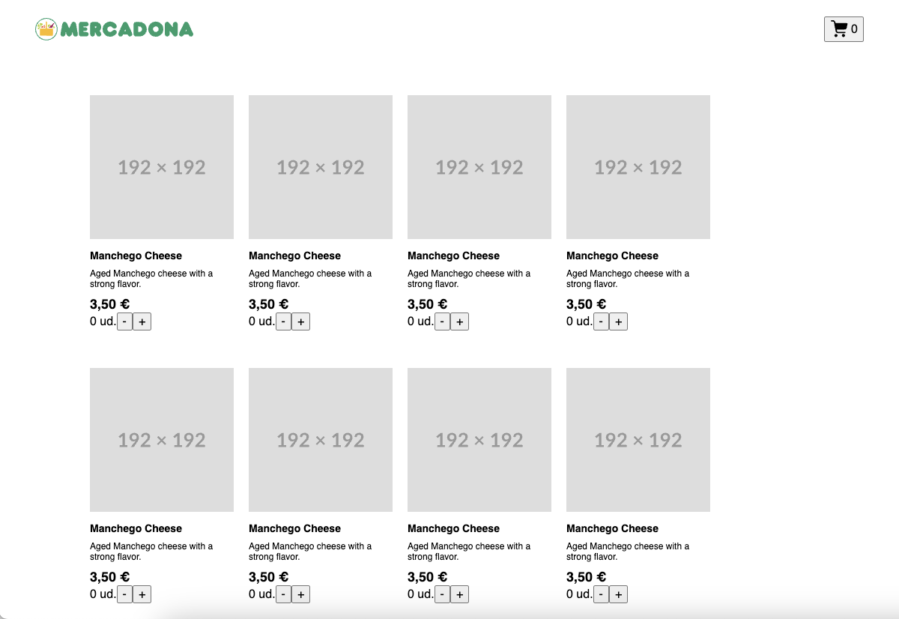

# Frontend interview

## Context

You will work on an e-commerce application for food products (fruits, vegetables, dairy, etc.). The goal is to evaluate your knowledge of React, state management, hooks, testing and CSS/HTML best practices, as well as your ability to communicate technical decisions.

## Goals

1. **Catalog interface:** display a list of products obtained from a simulated API.
2. **Shopping cart:** view total, modify quantities and delete items.
3. **Testing:** testing the application with Jest/Vite and React Testing Library.

## Functional requirements

| Functionality | Detail                                                                                                                                   |  
|---------------|------------------------------------------------------------------------------------------------------------------------------------------|
| Products list | Served from http://localhost:8000/api/products. The user should be able to visualize the product list in a grid and add items to the cart |         
| Shopping cart | Route `/cart`.  The user should be able to edit quantities and remove items                                                              |

### Testing

You can either use Jest or Vitest with React Testing Library. You can use the testing library of your choice, but you should be able to run the tests with `npm run test`.

## The boilerplate

The project is a Vite + React application. You can run the application with `npm run dev` and the tests with `npm run test`.  To start the API you can use `npm run server`. The API is a simple Express server that serves the products list. You can start the API with the command `npm run api`. The API is a simple Express server that serves the products list. You can start the API with the command `npm run api`. The API documentation is served at `http://localhost:8000/docs`.

## Screenshots

### Home page

### Cart page

