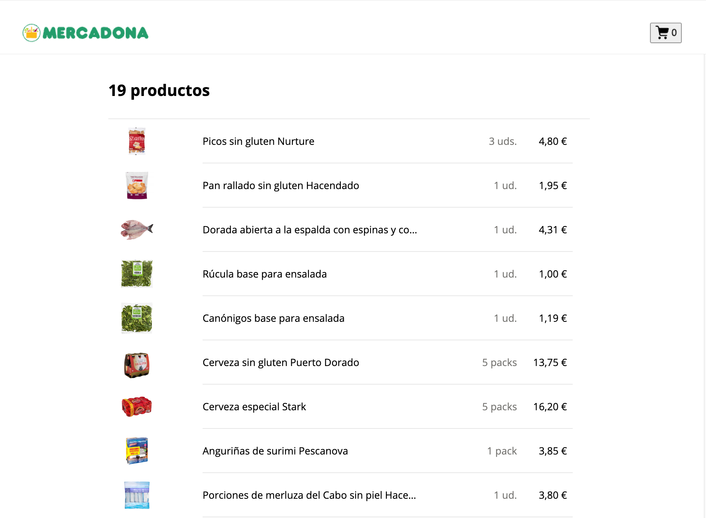

# Frontend interview

## Context

You will work on an e-commerce application for food products (fruits, vegetables, dairy, etc.). The goal is to evaluate your knowledge of React, state management, hooks, testing and CSS/HTML best practices, as well as your ability to communicate technical decisions.

## Goals

1. **Catalog interface:** display a list of products obtained from a simulated API.
2. **Shopping cart:** view summary, view total quantities, modify quantities of items in cart and delete items from cart.
3. **Testing:** testing the application with Vitest and React Testing Library.

## Functional requirements

| Functionality        | Detail                                                                                                                                    |  
|----------------------|-------------------------------------------------------------------------------------------------------------------------------------------|
| Products list        | Served from http://localhost:8000/api/products. The user should be able to visualize the product list in a grid and add items to the cart |
| Shopping cart button | Shows the total units added to the cart.  Clicking the button should navigate to the checkout page                                        |
| Checkout page        | Route `/checkout`.  The user should be able to see all the products with their total quantity/price per product                           |

## The boilerplate

The project is a Vite + React application. You can run the application with `npm run dev` and the tests with `npm run test`. The API is a simple Express server that serves the products list. You can start the API with the command `npm run api`. The API documentation is served at `http://localhost:8000/docs`.

## Screenshots

### Home page

### Cart page

---

# Entrevista Frontend

## Contexto

Vas a trabajar en una aplicación de e-commerce para alimentos (frutas, verduras, lácteos, etc.). El objetivo es evaluar tu conocimiento de React, manejo de estados, hooks, testing y buenas prácticas en CSS/HTML, así como tu capacidad para comunicar decisiones técnicas.

## Objetivos

1. **Interfaz de catálogo:** mostrar una lista de productos obtenidos desde una API simulada.
2. **Carrito de compras:** ver el resumen, ver cantidades totales, modificar cantidades de productos y eliminar productos del carrito.
3. **Testing:** probar la aplicación con Vitest y React Testing Library.

## Requisitos funcionales

| Funcionalidad      | Detalle                                                                                                                                                     |  
|--------------------|-------------------------------------------------------------------------------------------------------------------------------------------------------------|
| Lista de productos | Se encuentra en http://localhost:8000/api/products. El usuario debe poder visualizar la lista de productos en una cuadrícula y agregar productos al carrito |
| Botón del carrito  | Muestra el total de unidades agregadas al carrito. Al hacer clic en el botón se debe navegar al checkout                                                   |
| Checkout           | Ruta `/checkout`. El usuario debe poder ver todos los productos con su cantidad total y precio por producto                                                 |

## El boilerplate

El proyecto es una aplicación de Vite + React. Puedes ejecutar la aplicación con `npm run dev` y las pruebas con `npm run test`. La API es un servidor Express simple que sirve la lista de productos. Puedes iniciar la API con el comando `npm run api`. La documentación de la API está disponible en `http://localhost:8000/docs`.

## Capturas de pantalla

### Página de inicio

### Página del carrito

